<!-- Animated Hero Banner -->
<picture>
  <source media="(prefers-color-scheme: dark)" srcset="assets/dark.svg">
  <source media="(prefers-color-scheme: light)" srcset="assets/light.svg">
  
</picture>

<div align="center">


<br/><br/>

[](https://www.linkedin.com/in/ayesha-ali-784912375/)
[](https://www.instagram.com/codewithayeshaali/)
[](mailto:codewithayeshaali@gmail.com)

</div>

---

## 👩‍💻 About Me

```ts
const ayesha = {
  role:       "Web & Mobile Developer",
  focus:      ["React", "Next.js", "Flutter"],
  learning:   "Express.js & backend development",
  email:      "codewithayeshaali@gmail.com",
  motto:      "Build it. Ship it. Improve it.",
};
```

I'm **Ayesha Ali** — a passionate developer who loves building clean, beautiful applications. I focus on crafting smooth user experiences on the web with React and Next.js, and on mobile with Flutter.

- 🔭 Currently building projects with **React** and **Next.js**
- 📱 Creating cross-platform mobile apps with **Flutter**
- 🌱 Learning **Express.js** and backend development
- ⚡ I enjoy turning ideas into real, working products

---

## 🛠️ Tech Stack

**Frontend**


**Mobile**


**Languages**


**Currently Learning**


**Tools**


---

## 📊 GitHub Stats

<div align="center">
  
</div>

---

## 📈 Contribution Graph

<div align="center">
  
</div>

---

## 🤝 Let's Connect

<div align="center">


<br/><br/>

[](https://www.linkedin.com/in/ayesha-ali-784912375/)
[](https://www.instagram.com/codewithayeshaali/)
[](mailto:codewithayeshaali@gmail.com)

</div>

<br/>

<!-- Footer Banner -->


